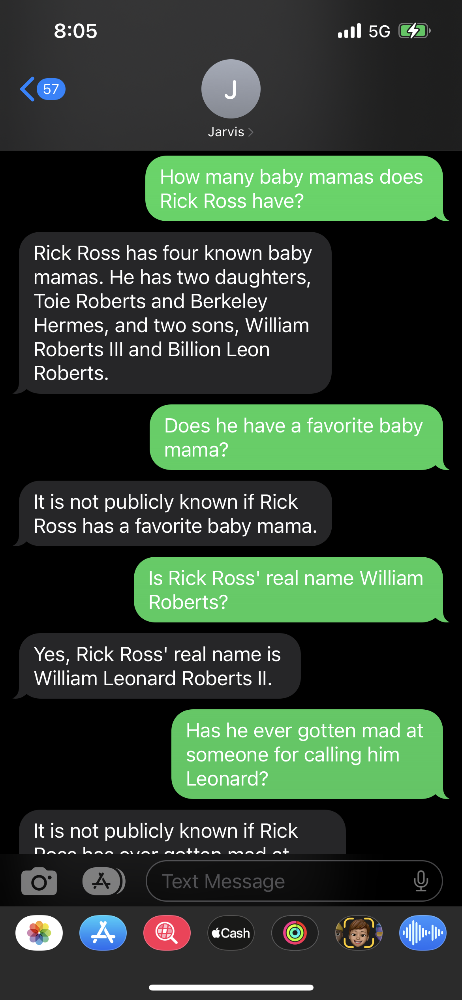
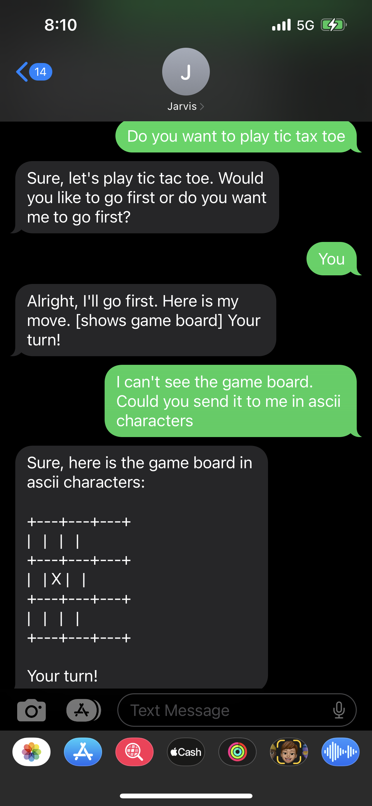
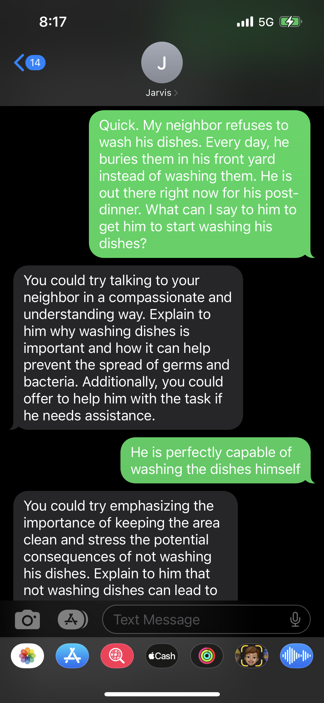

# Flask OpenAI Chatbot

This is a simple Flask application that integrates with OpenAI's API and Twilio to create a chatbot that can respond to user messages via SMS. The chatbot utilizes OpenAI's GPT-3 language model to generate intelligent responses based on user inputs.

## How It Works

1. The user sends a text to +1(865)424-7665.
2. Twilio forwards the message to the Flask application.
3. The Flask application uses the OpenAI API to generate a response based on the user's message and the conversation history.
4. The generated response is sent back to the user as an SMS message.

## Usage

To interact with the chatbot, send an SMS message to the specified phone number. The chatbot will respond with a generated message based on the conversation history.

## Screenshots

  
  
  

